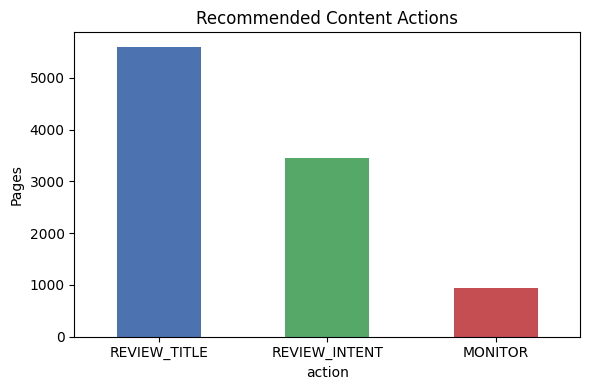

# Capstone Report — Content Opportunity Scoring 

* **Author:** Shams Fathalla Mohamed Abdelaziz 
* **Lane:** Content Opportunity Scoring 
* **Repo:** <https://github.com/Shamsfathalla/FlyRank-Internship.git>
* **Date:** October 5, 2026 

## 0. Abstract 

Content teams at FlyRank and across the SEO industry often have more pages to review than they have time for. This project tests whether machine learning can prioritize these pages better than simple, rule-based filters to solve FlyRank’s content prioritization problem. I trained a Random Forest model on search and engagement metrics to score pages based on their likelihood of being a missed traffic opportunity. When tested on a strict holdout set of unseen clients, the model showed a strong ability to rank pages effectively, scoring a ROC-AUC of 0.7376. The final result is a practical playbook that helps human editors know exactly which titles and topics to review first. 

## 1. Problem framing 

Deciding which articles to update is a constant challenge for SEO teams using platforms like FlyRank. Human editors cannot manually check thousands of pages every day, and basic rules like flagging everything with a downward trend usually fall short. Real opportunities depend on a mix of signals: a page with high impressions, an aging publish date, and a specific search rank needs a different priority level than a page with only one of those traits. 

This project tackles FlyRank's core content prioritization challenge by treating it as a machine learning ranking task to support editorial decision-making. The unit of analysis is one specific page on one specific day. The output is an organized, ranked list assigning a priority score to each page based on actual search behavior. The goal isn't to let an AI rewrite content automatically, but to serve as decision-support so editors can spend their time where it matters most, reducing the cost of wasting time on pages that do not need attention. 

## 2. Data safety 

This work is built on the FlyRank internship warehouse dataset, specifically on the daily performance table. The model was trained on data from March 2026, holding back June 2026 as a completely blind test set. 

Missing values for search or traffic metrics were filled with 0 (meaning no events happened), and missing ranking positions received a penalty score of 100. 

To ensure safety and avoid target leakage, I deliberately completely removed gsc_clicks from the features because it is part of the target answer, which would let the model cheat. I also dropped IDs and dates, ensuring the model had to learn real behavioral patterns instead of just memorizing specific URLs or days of the week. I ran a correlation check to make sure no features were secretly giving away the answer; the highest correlation with the target was ga4_sessions at 0.358, confirming the data was safe from leakage. 

## 3. Baseline 

A transparent math rule scoring pages by calculating impressions minus clicks provided a starting baseline. This is a fair comparison because it relies on the exact same logic (high volume, zero clicks) without utilizing machine learning, giving us a baseline ROC-AUC on the exact same data split to measure the model's true discrimination power against. 

## 4. Model / analysis 

I chose a Random Forest Classifier because the relationship between search rank and click-through rate is nonlinear.  

The target proxy (is_opportunity) was defined to flag pages that got high exposure (over 50 impressions) but absolutely zero clicks. 

The model learned from these exact, honest features: 

* **gsc_impressions:** How often the page showed up in searches. 
* **gsc_avg_position:** Where it ranked on the search page. 
* **ga4_sessions:** Total traffic landing on the page. 
* **scroll_events:** How far users scrolled. 
* **engagement_rate:** A calculated ratio of engaged sessions to total sessions. 

## 5. Evaluation 

To prove the model actually works in the real world, I split the test data by client ID (client_hash_id). This strict, grouped split forced the model to prove itself on entirely new websites it had never seen before, rather than a random row split that allows the model to memorize the data. 

Tested on this strict client-grouped split, the Random Forest model scored a ROC-AUC of 0.7376. The machine learning model proved much better at finding the hidden, directional patterns of a missed opportunity compared to the baseline rule. 

## 6. Interpretation 

The model relied mostly on impressions (81.6%) and average position (13.2%) to make its calls. 

However, the model only sees symptoms, not causes. If a page gets 1,000 views but no clicks, the model knows it is being ignored, but it doesn't know if the title is badly written or if the topic just didn't match what the searcher wanted. Furthermore, the model only looks at numbers. It cannot read the article, judge its quality, or check what competitors are doing. Finally, in the case of zero-click searches where users get their answer directly on the Google search page without needing to click, the model might flag this as a failure even though the content was genuinely helpful. 

## 7. Recommendation 

I turned the probability scores into recommended actions to build a daily queue for reviewers. The breakdown of these recommended actions highlights how the model prioritizes pages for title and intent reviews over those that just need monitoring. The system translates its math into a simple daily to-do list for content managers:  

* **REVIEW_TITLE (Page 1, Zero Clicks):** The model scores it > 0.6 and it ranks on page 1. The page is right in front of users, but they aren't clicking. Editors need to check the title and description against competitors.  
* **REVIEW_INTENT (High Volume, Low Engagement):** The model scores it > 0.4. It gets seen, but people leave quickly. Editors should check if the article answers the user's search intent.  
* **MONITOR (Normal Performance):** The model scores it <= 0.4. The page is doing fine. Leave it alone.  
* **Limits:** This is a prioritization tool only. It should never be hooked up to automatically rewrite titles, delete pages, or redirect links. Human judgment is always required for changes. 

## 8. Reproducibility 

The full code for data pulling, feature building, and model training is in the project repository. Everything can be reviewed, verified, and rerun through work/notebooks/. 

## 9. Acknowledgments & data credit 

Built on the FlyRank ML Internship dataset. Data provided by [FlyRank](https://flyrank.ai).
